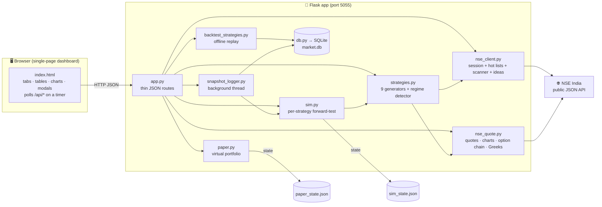
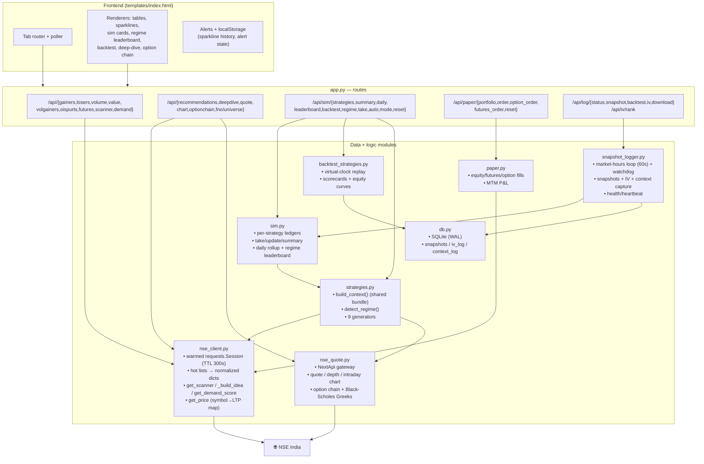
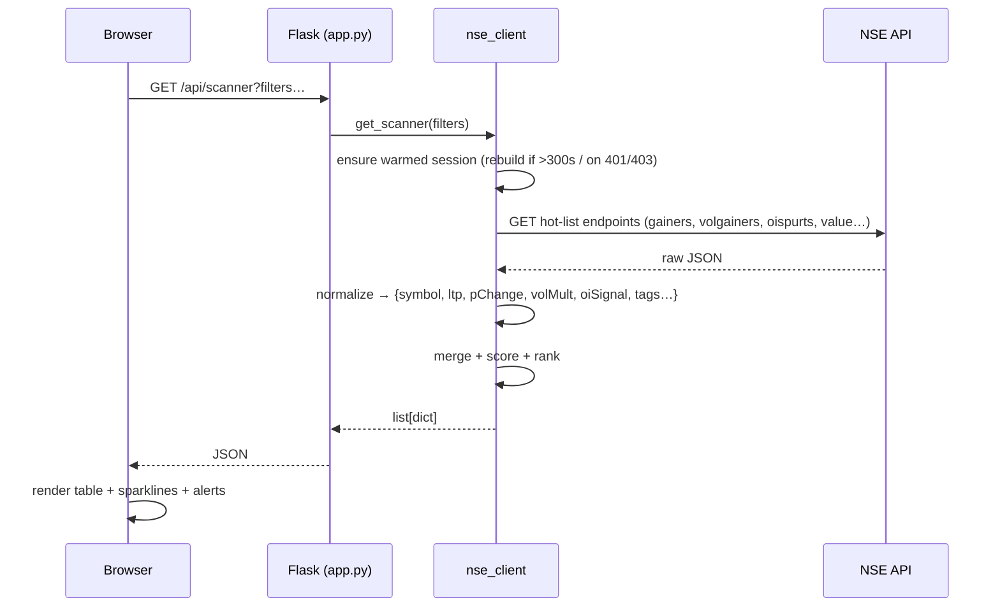
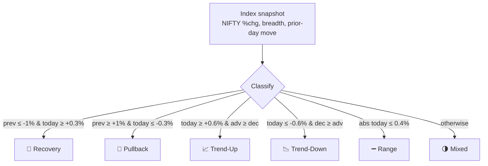
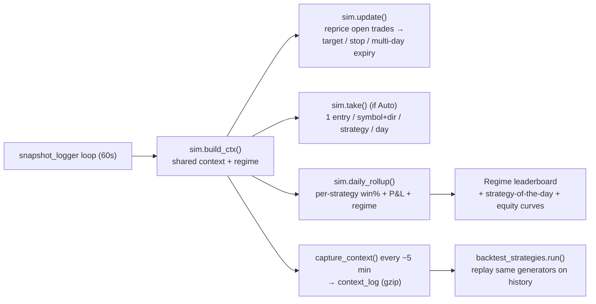
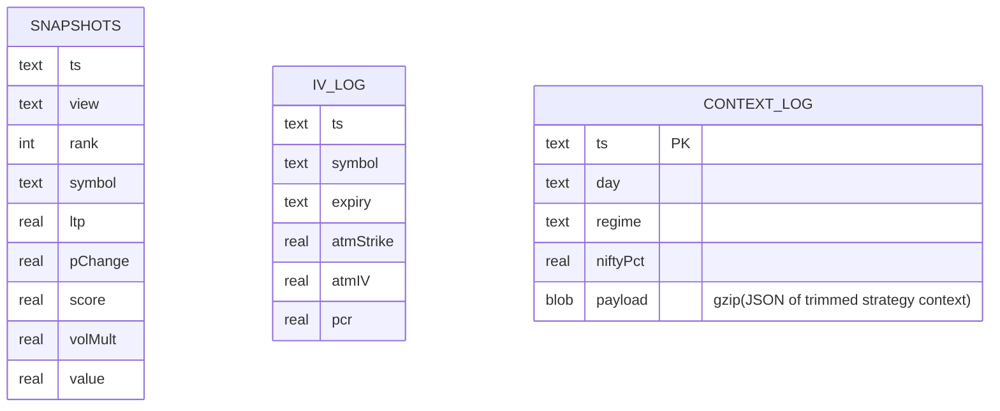
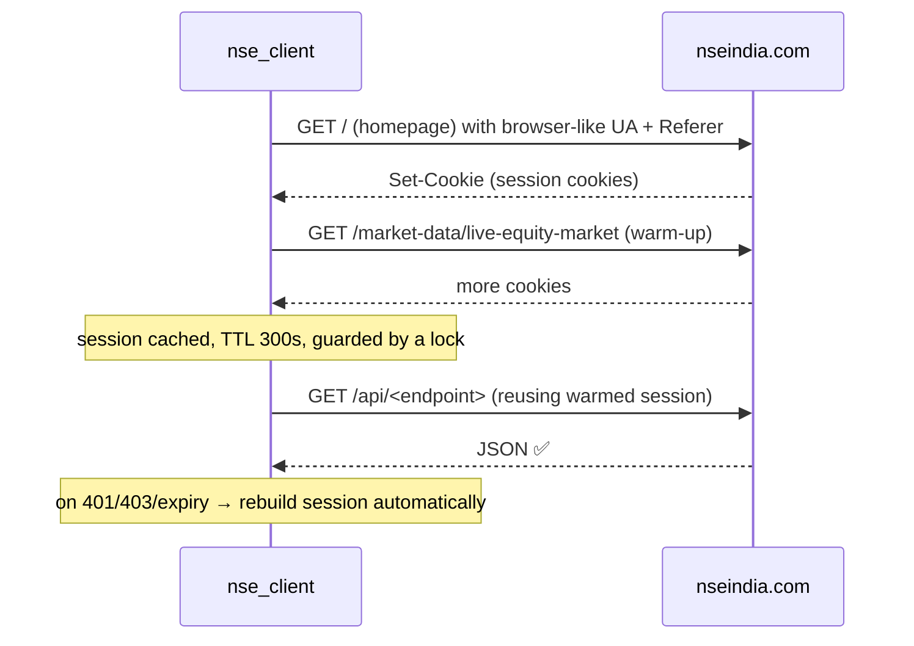

# NSE Market Pulse

A live dashboard **+ CLI + strategy lab** that surfaces which NSE (National Stock
Exchange of India) stocks are **in demand right now**, generates ranked trade
ideas, forward-tests several trading strategies against detected **market
regimes**, and lets you **paper-trade** equities, futures and options — all from
NSE India's public JSON API, in an auto-refreshing web UI with no build step.

> **Disclaimer:** For **educational and research purposes only**. It uses NSE
> India's unofficial/public endpoints and is **not affiliated with NSE**.
> Nothing here is investment advice. Intraday/derivatives trading is high-risk —
> always use stop-losses and proper risk management.

---

## Table of contents

- [What it does](#what-it-does)
- [Feature tour](#feature-tour)
- [High-level architecture](#high-level-architecture)
- [Detailed architecture](#detailed-architecture)
- [Data flow](#data-flow)
- [Strategy sim, regimes & backtest](#strategy-sim-regimes--backtest)
- [Data storage](#data-storage)
- [Getting started](#getting-started)
- [API reference](#api-reference)
- [Project structure](#project-structure)
- [How the NSE session works](#how-the-nse-session-works)
- [Notes & limitations](#notes--limitations)

---

## What it does

NSE Market Pulse pulls NSE's live "hot lists" (gainers, losers, most-active,
volume gainers, OI spurts, F&O futures), normalizes them into stable shapes, and
layers analytics on top:

- a **composite demand score** and a filterable **scanner**,
- an **Ideas engine** that turns signals into LONG/SHORT setups with entry / stop
  / target,
- a **library of 7 named strategies**, each forward-tested in its **own parallel
  simulation** and compared **day-by-day against the market regime**,
- an **offline backtester** that replays those strategies over archived data,
- **paper trading** for equities, futures (margin/leverage) and options (lot-size
  enforced),
- per-stock **deep-dive** analysis (30/60/90-day price + delivery + OI history),
- live **option chains**, **Greeks**, **market depth** and **intraday charts**.

---

## Feature tour

### Market data views (tabs)
| Tab | What it shows |
|---|---|
| ⚡ **Futures** *(default)* | Stock futures with basis (premium/discount to spot), annualized carry, OI buildup, and a **Momentum panel** ranking the strongest bullish/bearish movers. Toggle **All F&O** to sweep the full ~215-name universe. |
| 💡 **Ideas** | Ranked LONG & SHORT setups from live signals (momentum, OI buildup, unusual volume, money flow) — each with a conviction score, plain-English reasons, and an entry/stop/target plan. |
| 🧪 **Sim** | The multi-strategy forward-test + regime leaderboard + offline backtest (see [below](#strategy-sim-regimes--backtest)). |
| 🔎 **Scanner** | One ranked board combining volume spikes, money flow, momentum & OI buildup, with filters (direction, %chg, volume ×avg, value, OI signal, F&O-only). |
| ★ **Demand Score** | Composite ranking — stocks appearing across gainers, money-flow & volume spikes float to the top. |
| **Volume Gainers** | Stocks trading far above their average volume. |
| **F&O Open Interest** | OI spurts, classified long buildup / short buildup / short covering / long unwinding. |
| **Top Gainers / Losers**, **Most Active (Volume / Value)** | The classic NSE boards. |

### Analytics & tooling
- **Live sparklines** per row (accumulated client-side; persisted in `localStorage`).
- **Deep-dive** (🔬 on any row): 30/60/90-day OHLCV, delivery %, and F&O OI
  history with actionable read-outs.
- **Stock detail modal**: real **OHLCV candlestick chart with a volume
  histogram** (1m/5m/15m/1D selector, hover → open/high/low/close, %chg, volume &
  time), key metrics, and buy/sell.
- **Option chain**: full chain for any equity/index, PCR, Max-Pain, ATM, and
  **Greeks** (Black-Scholes: delta/gamma/theta/vega), OI walls, IV skew.
- **Market depth**: 5-level bid/ask.
- **Alerts**: desktop notification + beep when a stock crosses a configurable
  volume multiple with a rising price; **Sim alerts** when a strategy takes new
  ideas or a trade hits target/stop.
- **CSV export** of the current view.

### Paper trading (virtual, `paper.py`)
- Starts at ₹10,00,000. **Equities**, **futures** (margin ≈15%, long/short with
  netting, live MTM) and **options** (lot-size enforced). Live P&L + order
  history; state persisted to `paper_state.json`.

---

## High-level architecture



**Design tenets:** keep `app.py` thin (routes only); all NSE access funnels
through `nse_client` / `nse_quote`; strategies consume a **single shared context**
per cycle so NSE isn't hammered; time-series → SQLite, small state → JSON.

---

## Detailed architecture



---

## Data flow

A typical view refresh (e.g. the Scanner tab polling every few seconds):



---

## Strategy sim, regimes & backtest

The **Sim** tab turns the Ideas engine into a **library of strategies**, each
forward-tested in parallel and compared against the day's **market regime**.

**The 9 strategies** (`strategies.py`):

| id | Name | Edge |
|---|---|---|
| `momentum` | Multi-Signal Momentum | Price move confirmed by volume + OI buildup + breadth |
| `oi_smart` | F&O OI Smart-Money | Pure derivatives positioning (buildup / covering / unwinding) |
| `meanrev` | Mean-Reversion Bounce | Buy oversold liquid names, fade over-extended spikes |
| `vol_breakout` | Volume Breakout | ≥5× average-volume explosions in the move's direction |
| `high52w` | 52-Week-High Momentum | Nearness to 52wH (George–Hwang anchoring edge) |
| `vwap` | VWAP Trend | Price vs the day's cumulative VWAP benchmark |
| `delivery` | Delivery% Accumulation | High delivery % = real conviction (accumulation/distribution) |
| `orb` | Opening-Range Breakout | Break of the first 15-min range (09:15–09:30) with volume (minute candles) |
| `ivwap` | Intraday VWAP Reclaim | True session VWAP from minute candles: hold above/reject below |

> `orb` and `ivwap` need minute candles (`ctx["candles"]`), so they run in the
> live forward-sim; they're inert in the offline backtest, which replays the
> trimmed `context_log` (candles aren't archived).

**Regime detection** classifies each day from NIFTY %change + advance/decline
breadth + the prior session's move:



**Forward-sim lifecycle** — during market hours the background logger drives it:



- **Entry modes:** `continuous` (take fresh ideas each cycle, deduped) or `open`
  (one snapshot near the open).
- **Exit:** target / stop, else time-expire after `maxSessions` (default 3).
- **Risk-based sizing:** every trade risks a fixed ₹2,000 to its stop (position
  size = risk ÷ stop-distance, notional-capped), so results are reported in
  **R-multiples** and **expectancy** (avg R/trade) — a fair comparison across
  strategies regardless of price or stop width.
- **Intrabar resolution:** target/stop are resolved against **real 1-min OHLCV**
  (a LONG stop is hit when a bar's *low* ≤ stop, a target when its *high* ≥
  target; a bar straddling both is assumed to hit the stop first). This removes
  the missed-wick / late-fill bias of sampling a single LTP, and yields true
  **MFE/MAE** (max favorable/adverse excursion) and **time-to-exit**. Symbols with
  no charting token fall back to LTP resolution. See `intrabar.py`.
- **Regime leaderboard:** aggregates every trade by *regime × strategy* to answer
  "which strategy wins on a recovery day vs a trend-up day", and picks a
  **strategy-of-the-day**.
- **Offline backtest** (`/api/sim/backtest[?resolve=intrabar|ltp]`): replays the
  *same* generators over archived `context_log`, opening trades from the context
  and resolving exits on real minute candles — no need to wait for live days once
  context has been captured.
- **Per-trade replay** (▶ on any sim trade): the trade's minute candles with
  entry/target/stop/exit overlaid, plus MFE/MAE and time-to-exit.

---

## Data storage

Time-series → **SQLite** (`db.py`, `data/market.db`); small document-shaped state
→ **JSON**. Not Postgres/Mongo (they need a server; overkill for a single-user
local tool).



- `snapshots` — the demand/volume-gainers board, one row per symbol per snapshot.
- `iv_log` — ATM implied-volatility captures.
- `context_log` — a trimmed, gzipped snapshot of the full strategy context each
  cycle (~6 KB), which powers the offline backtest.
- WAL mode + indexes on `view/ts/symbol/day`. Legacy `snapshots.csv` / `iv_log.csv`
  are auto-imported on first run.

---

## Getting started

```bash
# 1. Clone
git clone git@github.com:aakash-jain-1/nse-market-pulse.git
cd nse-market-pulse

# 2. (Optional) virtual environment
python -m venv .venv
.venv\Scripts\activate       # Windows
source .venv/bin/activate     # macOS/Linux

# 3. Install dependencies
pip install -r requirements.txt

# 4. Run the dashboard
python app.py
```

Then open **http://127.0.0.1:5055**.

> **Why port 5055?** A previously-installed service worker from another local app
> can hijack `127.0.0.1:5000`. If you ever see the wrong app there, hard-refresh
> (Ctrl+Shift+R) or unregister the service worker.
>
> **Windows tip:** if the bare `python` command resolves to the Microsoft Store
> shim, use the full interpreter path (e.g.
> `C:/Users/<you>/AppData/Local/Programs/Python/Python313/python.exe`).

Best results during market hours (Mon–Fri, 09:15–15:30 IST): the background
logger captures snapshots + strategy context automatically, feeding the sim and
the backtest.

### Command-line scanner

```bash
python nse_demand.py            # everything
python nse_demand.py gainers    # top gainers
python nse_demand.py volume     # most active by volume
python nse_demand.py value      # most active by value
python nse_demand.py volgainers # volume gainers (unusual activity)
python nse_demand.py losers     # top losers
```

---

## API reference

| Method & path | Purpose |
|---|---|
| `GET /` | Dashboard UI |
| `GET /api/gainers · /losers · /volume · /value · /volgainers · /oispurts` | NSE hot lists (normalized) |
| `GET /api/futures` · `/api/futures/all` · `/api/futures/<sym>` | Stock futures (most-active / full universe / one) |
| `GET /api/scanner` | Ranked in-demand board (accepts filters) |
| `GET /api/demand` | Composite demand-score board |
| `GET /api/recommendations[?fno=1]` | Ranked LONG/SHORT trade ideas |
| `GET /api/deepdive/<sym>` | 30/60/90-day price + delivery + OI deep-dive |
| `GET /api/quote/<sym>` · `/api/chart/<sym>` | Live quote + market depth · intraday price line |
| `GET /api/ohlc/<sym>?interval=<n>&type=<I\|D>&days=<n>` | Real OHLCV candles + volume (`charting.nseindia.com`) |
| `GET /api/optionchain/<sym>[/summary]` | Full option chain / analytics (PCR, Max-Pain, Greeks) |
| `GET /api/fno/universe` | List of F&O underlyings |
| `GET /api/sim/strategies · /summary[?strategy=] · /daily · /leaderboard · /regime` | Sim reads |
| `GET /api/sim/backtest[?entryMode=&maxSessions=&days=&resolve=intrabar\|ltp]` | Offline strategy backtest (intrabar OHLCV exits) |
| `POST /api/sim/take · /auto · /mode · /reset` | Sim controls |
| `GET /api/paper/portfolio` · `POST /api/paper/order · /option_order · /futures_order · /reset` | Paper trading |
| `GET /api/log/status · /health · /backtest` · `POST /api/log/snapshot · /iv` · `GET /api/log/download` | Snapshot logger status/health + signal backtest + CSV export |
| `GET /api/iv/rank/<sym>` | IV rank/percentile from logged ATM-IV history |

---

## Project structure

```
nse-market-pulse/
├── app.py                  # Flask server + JSON API (thin routes) — port 5055
├── nse_client.py           # NSE session mgmt + hot lists + scanner + ideas (CORE)
├── nse_quote.py            # Quote/chart/depth + option chain + Greeks + OHLCV candles
├── strategies.py           # 9 strategy generators + market-regime detector
├── sim.py                  # Multi-strategy forward-tester + regime leaderboard
├── intrabar.py             # Minute-candle trade resolver (target/stop/MFE/MAE)
├── backtest_strategies.py  # Offline backtester (replays strategies, OHLCV exits)
├── test_intrabar.py        # Unit tests for the intrabar resolver
├── paper.py                # Paper-trading engine (equity/futures/options)
├── snapshot_logger.py      # Background logger (snapshots + IV + context) → SQLite
├── db.py                   # SQLite store (time-series)
├── nse_demand.py           # Standalone CLI scanner
├── templates/
│   └── index.html          # Entire dashboard UI (HTML + CSS + JS inline)
├── data/                   # (gitignored) market.db + any legacy CSVs
├── requirements.txt
├── README.md
├── AGENTS.md               # Context/spec for AI agents & future sessions
└── *.json                  # (gitignored) sim_state.json, paper_state.json
```

---

## How the NSE session works

NSE blocks plain HTTP requests (Akamai bot protection). `nse_client.py`:



Every endpoint response is normalized into stable keys (`symbol`, `ltp`,
`pChange`, `volume`, `oiSignal`, …) so the frontend and CLI never depend on NSE's
raw field names.

---

## Notes & limitations

- All endpoints are **unofficial** and can change without notice.
- Data is only meaningful during **NSE market hours** (Mon–Fri, 09:15–15:30 IST);
  outside that you'll see the last snapshot or empty lists.
- The **offline backtest** only has real signal once the logger has archived
  strategy *context* across live sessions (idea generation can't be back-filled —
  NSE doesn't retain the hot-lists / scores). Exit resolution, by contrast, uses
  on-demand minute OHLCV, so it's accurate as soon as there's context to replay.
- OHLCV candlesticks come from `charting.nseindia.com` (fetched on demand, cached
  ~30s); NSE itself retains the history (~30–40 days of 1-min, years of daily), so
  we don't archive candles — we just query the window we need. Symbols without a
  charting token fall back to the price-only NextApi line, then to a sparkline.
- No API key needed; **no secrets in the repo** (`.gitignore` covers `.env`,
  `*.db`, state JSON, CSVs).

---

*Built for learning about market microstructure and systematic strategy
evaluation. Trade responsibly.*
