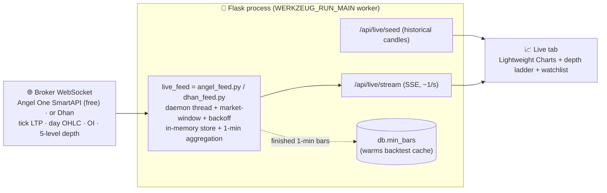
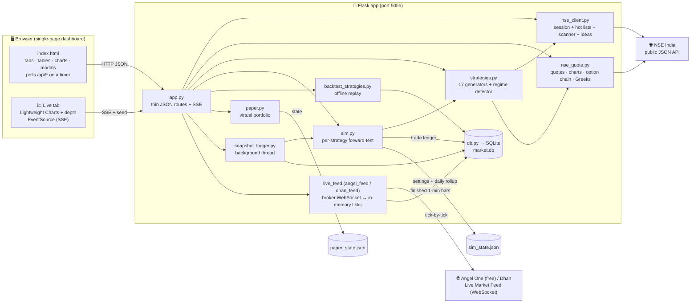
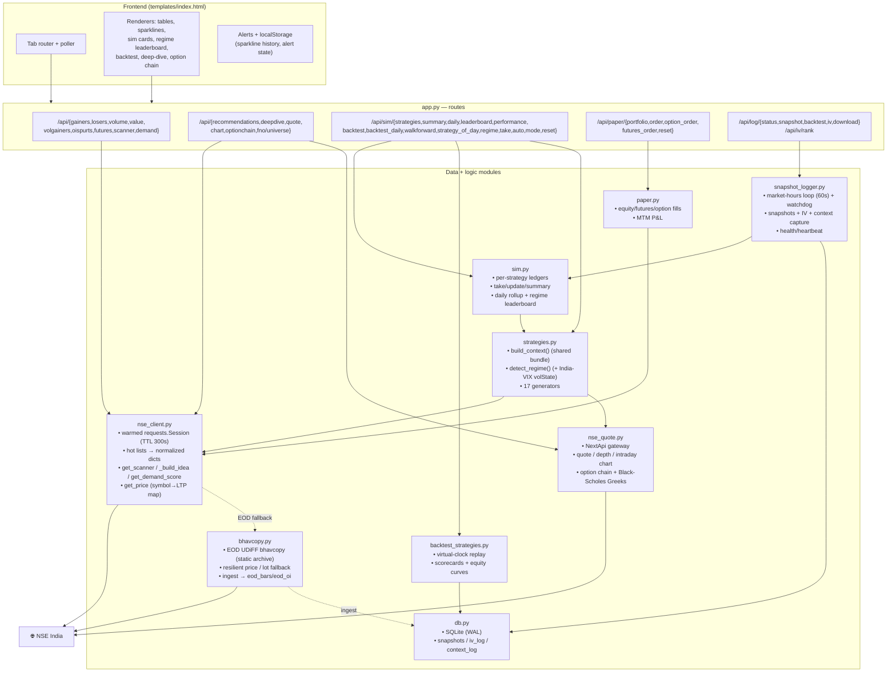
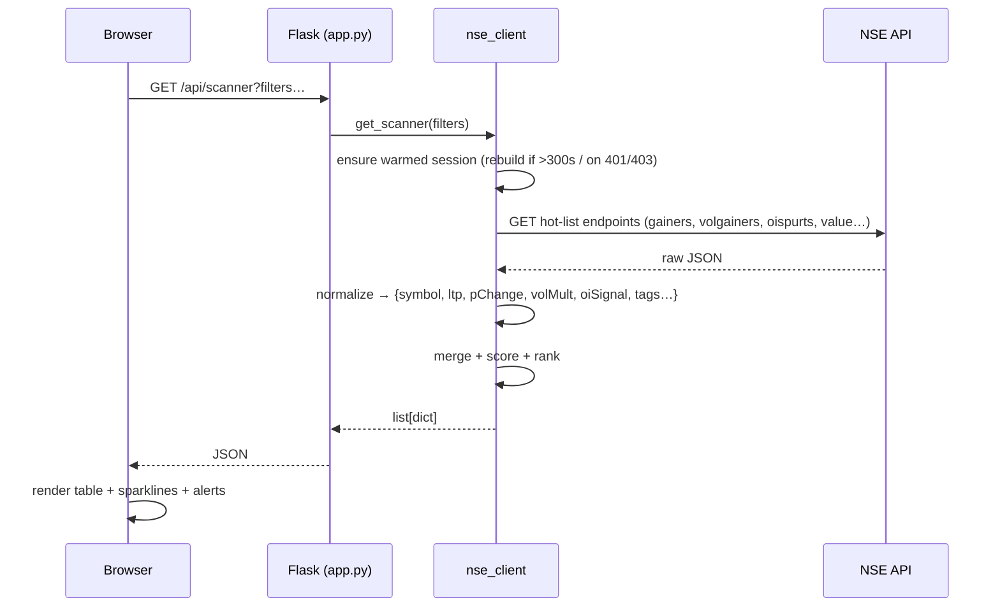
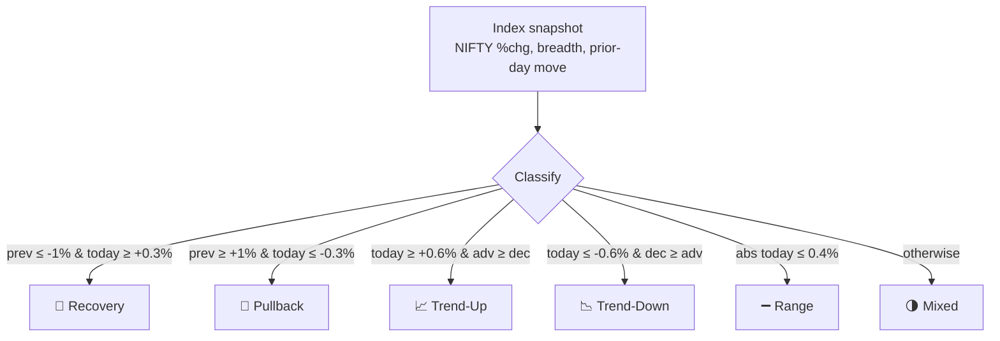
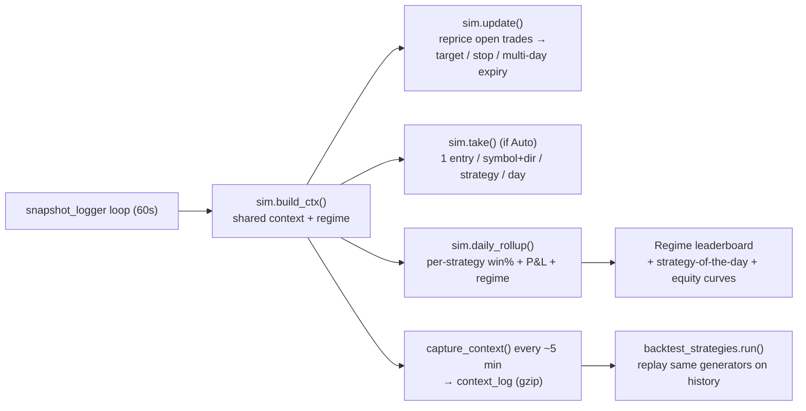
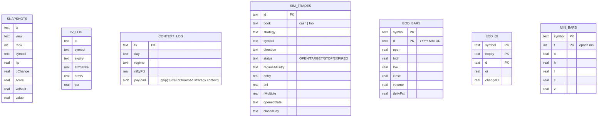
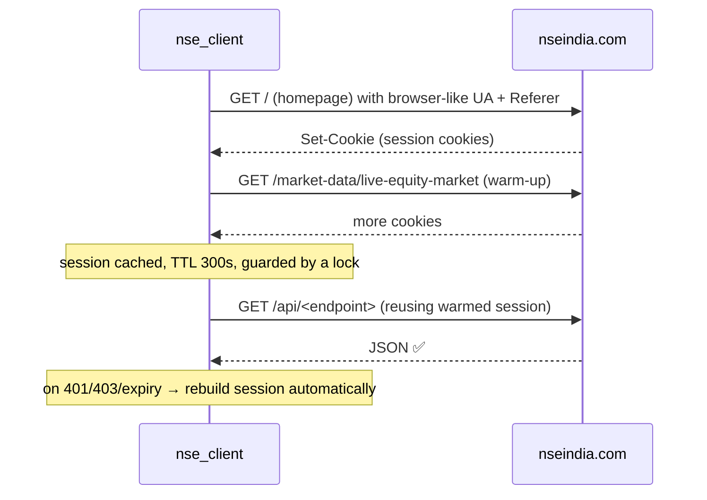

# NSE Market Pulse

A live dashboard **+ CLI + strategy lab** that surfaces which NSE (National Stock
Exchange of India) stocks are **in demand right now**, generates ranked trade
ideas, forward-tests several trading strategies against detected **market
regimes**, streams **genuine tick-by-tick realtime charts** (optional free Angel One feed),
and lets you **paper-trade** equities, futures and options — mostly from NSE
India's public JSON API, in an auto-refreshing web UI with no build step.

> **Disclaimer:** For **educational and research purposes only**. It uses NSE
> India's unofficial/public endpoints and is **not affiliated with NSE**.
> Nothing here is investment advice. Intraday/derivatives trading is high-risk —
> always use stop-losses and proper risk management.

---

## Table of contents

- [What it does](#what-it-does)
- [Feature tour](#feature-tour)
- [Live realtime data (free broker feed)](#live-realtime-data-free-broker-feed)
- [High-level architecture](#high-level-architecture)
- [Detailed architecture](#detailed-architecture)
- [Data flow](#data-flow)
- [Strategy sim, regimes & backtest](#strategy-sim-regimes--backtest)
- [Data storage](#data-storage)
- [Getting started](#getting-started)
- [API reference](#api-reference)
- [Project structure](#project-structure)
- [How the NSE session works](#how-the-nse-session-works)
- [Notes & limitations](#notes--limitations)

---

## What it does

NSE Market Pulse pulls NSE's live "hot lists" (gainers, losers, most-active,
volume gainers, OI spurts, F&O futures), normalizes them into stable shapes, and
layers analytics on top:

- a **composite demand score** and a filterable **scanner**,
- an **Ideas engine** that turns signals into LONG/SHORT setups with entry / stop
  / target,
- a **library of 10 named strategies** (incl. a **regime-adaptive** meta-strategy
  that follows the strategy-of-the-day), each forward-tested in its **own parallel
  simulation** and compared **day-by-day against the market regime**,
- an **offline backtester** that replays those strategies over archived data,
- **paper trading** for equities, futures (margin/leverage, long/short) and options
  (lot-size enforced, buy or **write/short**),
- per-stock **deep-dive** analysis (30/60/90-day price + delivery + OI history),
- live **option chains**, **Greeks**, **market depth** and **intraday charts**.

---

## Feature tour

### Market data views (tabs)
| Tab | What it shows |
|---|---|
| ⚡ **Futures** *(default)* | Stock futures with basis (premium/discount to spot), annualized carry, OI buildup, and a **Momentum panel** ranking the strongest bullish/bearish movers. Toggle **All F&O** to sweep the full ~215-name universe. |
| 📈 **Live** | **Genuine realtime workspace** — TradingView-style candlesticks + volume (persistent chart), a streaming **watchlist**, an LTP/OHLC/VWAP quote header and a live **5-level depth ladder**, all pushed tick-by-tick from a broker WebSocket via SSE. Powered by **Angel One SmartAPI (free)** by default, or Dhan. Optional: shows a one-time setup card until you add credentials. See [Live realtime data](#live-realtime-data-free-broker-feed). |
| 💡 **Ideas** | Ranked LONG & SHORT setups from live signals (momentum, OI buildup, unusual volume, money flow) — each with a conviction score, plain-English reasons, and an entry/stop/target plan. |
| 🧪 **Sim** | The multi-strategy forward-test + regime leaderboard + offline backtest (see [below](#strategy-sim-regimes--backtest)). |
| 🎯 **F&O Sim** | The **same** forward-test as Sim, but a dedicated **parallel book that only trades F&O-eligible names** (ones you can actually take with futures/leverage). Same strategies, same live signals, same ₹2k/trade sizing — so you can compare F&O-only performance against the all-market book side by side. |
| 🔎 **Scanner** | One ranked board combining volume spikes, money flow, momentum & OI buildup, with filters (direction, %chg, volume ×avg, value, OI signal, F&O-only). |
| ★ **Demand Score** | Composite ranking — stocks appearing across gainers, money-flow & volume spikes float to the top. |
| **Volume Gainers** | Stocks trading far above their average volume. |
| **F&O Open Interest** | OI spurts, classified long buildup / short buildup / short covering / long unwinding. |
| **Top Gainers / Losers**, **Most Active (Volume / Value)** | The classic NSE boards. |

### Analytics & tooling
- **Live sparklines** per row (accumulated client-side; persisted in `localStorage`).
- **Deep-dive** (🔬 on any row): 30/60/90-day OHLCV, delivery %, and F&O OI
  history with actionable read-outs.
- **Stock detail modal**: real **OHLCV candlestick chart with a volume
  histogram** (1m/5m/15m/1D selector, hover → open/high/low/close, %chg, volume &
  time), key metrics, and buy/sell.
- **Option chain**: full chain for any equity/index, PCR, Max-Pain, ATM, and
  **Greeks** (Black-Scholes: delta/gamma/theta/vega), OI walls, IV skew.
- **Market depth**: 5-level bid/ask, with an **order-book pressure** signal — a
  buy/sell imbalance (ΣBid vs ΣAsk) + spread shown on the Live depth panel, the
  detail modal, and as per-row stripes on the Live watchlist. The **Scanner** adds
  an on-demand **⚖ Order-book scan** button + "Book" column (capped, pooled — no
  polling).
- **Alerts**: desktop notification + beep when a stock crosses a configurable
  volume multiple with a rising price; **Sim alerts** when a strategy takes new
  ideas or a trade hits target/stop. Plus **off-screen alerts** (🔔 Push) that
  reach your phone via **Telegram or a webhook** even with no tab open — server-side,
  opt-in (see *Getting started*).
- **CSV export** of the current view.

### Paper trading (virtual, `paper.py`)
- Starts at ₹10,00,000. **Equities**, **futures** (margin ≈15%, long/short with
  netting, live MTM) and **options** — lot-size enforced and **long OR short
  (writing)**: `SELL` opens a written short (you don't need to hold a long) that
  **receives the premium and posts margin** (~15% of notional, like a real broker);
  `BUY` covers it, freeing margin and realizing P&L. Long options pay the premium up
  front (no margin). Live P&L + order history; state in `paper_state.json`. *(Virtual
  money only — no broker, no real orders.)*

---

## Live realtime data (free broker feed)

Everything else in this project is **HTTP polling** of NSE's public endpoints
(finest granularity ≈1-min candles + ≈10-12 s quote snapshots). The **📈 Live**
tab adds a *genuine* realtime source: a broker's **Live Market Feed** over a
persistent **WebSocket**, pushed to the browser via **Server-Sent Events (SSE)**
and drawn with **TradingView Lightweight Charts** (Apache-2.0, the project's first
external JS dependency).

**Two providers, one interface.** The feed is provider-agnostic — `app.py` selects
`live_feed` at startup (`_select_live_feed()`):

| Provider | Cost | Ticks | 5-level depth | Auth |
|---|---|---|---|---|
| **Angel One SmartAPI** *(default)* | **Free** | ✅ | ✅ | API key + client code + MPIN + TOTP secret (auto login) |
| **Dhan** | Data API ₹499+GST/mo | ✅ | ✅ | client id + access token |

Angel One is preferred when configured (it's free — Angel charges only ₹20/order
brokerage on real trades, not for data); Dhan is used if only it is set up. It's
**entirely optional** — with no credentials the tab shows a setup card and the rest
of the app is unchanged.



**How it works**
- The selected adapter (`angel_feed.py` or `dhan_feed.py`) holds one WebSocket on a
  supervisor thread. Both share a hardened lifecycle: they connect **only during a
  market window** (~09:08–15:40 IST) and reconnect with **exponential backoff**, so
  an idle out-of-hours socket never storms the broker's connection limit. The
  broker's **scrip master** is cached to resolve `symbol → token` (~2400 NSE names;
  the tokens are NSE's standard ids, so RELIANCE → `2885` either way).
- Every packet updates an in-memory `LATEST[token]` record (LTP, day OHLC, volume,
  OI, best-5 depth) and folds the LTP into a **forming 1-minute candle** whose
  timestamp uses the **same IST-baked-as-UTC epoch** as `/api/ohlc`, so the live bar
  lines up exactly with the seeded history. Finished minutes are persisted to
  `db.min_bars`, so the Live feed also **warms the backtester's minute cache** for free.
- The chart is **seeded** from `/api/live/seed/<sym>` (reuses NSE's OHLCV feed),
  then an `EventSource` on `/api/live/stream` drives `candleSeries.update()`, the
  depth ladder and the quote header in realtime. The chart instance **persists**
  across the dashboard's poll timer (it isn't rebuilt every refresh).
- The **watchlist** (localStorage-persisted) sets what's subscribed via
  `POST /api/live/watch`; click a row to focus its chart; add/remove symbols.

**Setup (one-time)** — the tab shows provider-aware steps until configured.

*Angel One (recommended, free):*
1. Open a free **Angel One** account at `angelone.in`.
2. `smartapi.angelone.in` → **Create an App** → copy the **API key**.
3. Enable **TOTP** at `smartapi.angelone.in/enable-totp` and save the **base32 secret**.
4. Copy `angel_config.example.json` → `angel_config.json` and fill `api_key`,
   `client_code`, `mpin`, `totp_secret` *(or set `ANGEL_*` env vars)*. We compute the
   6-digit code from the secret with `pyotp`, so the daily session refresh is automatic.
5. **Restart** `python app.py` — the tab goes live automatically.

*Dhan (alternative — note the paid data plan):* subscribe to **DhanHQ Data APIs**
(₹499+GST/mo) at `web.dhan.co`, generate an access token, copy
`dhan_config.example.json` → `dhan_config.json` with your `client_id` +
`access_token`, and restart. If both are configured, Angel One wins.

> Credentials stay on your machine: `angel_config.json` / `dhan_config.json` are
> **gitignored** and never leave the app. Ticks only flow during market hours
> (09:15–15:30 IST); outside that the tab shows the last session and a "market
> closed" state. Lightweight Charts loads from CDN by default — drop the file in
> `static/vendor/lightweight-charts.standalone.production.js` to self-host offline.

---

## High-level architecture



**Design tenets:** keep `app.py` thin (routes only); all NSE access funnels
through `nse_client` / `nse_quote`; strategies consume a **single shared context**
per cycle so NSE isn't hammered; time-series → SQLite, small state → JSON.

---

## Detailed architecture



---

## Data flow

A typical view refresh (e.g. the Scanner tab polling every few seconds):



---

## Strategy sim, regimes & backtest

The **Sim** tab turns the Ideas engine into a **library of strategies**, each
forward-tested in parallel and compared against the day's **market regime**.

**The 17 strategies** (`strategies.py`):

| id | Name | Edge |
|---|---|---|
| `momentum` | Multi-Signal Momentum | Price move confirmed by volume + OI buildup + breadth |
| `oi_smart` | F&O OI Smart-Money | Pure derivatives positioning (buildup / covering / unwinding) |
| `meanrev` | Mean-Reversion Bounce | Buy oversold liquid names, fade over-extended spikes |
| `vol_breakout` | Volume Breakout | ≥5× average-volume explosions in the move's direction |
| `high52w` | 52-Week-High Momentum | Nearness to 52wH (George–Hwang anchoring edge) |
| `vwap` | VWAP Trend | Price vs the day's cumulative VWAP benchmark |
| `delivery` | Delivery% Accumulation | High delivery % = real conviction (accumulation/distribution) |
| `orb` | Opening-Range Breakout | Break of the first 15-min range (09:15–09:30) with volume (minute candles) |
| `ivwap` | Intraday VWAP Reclaim | True session VWAP from minute candles: hold above/reject below |
| `fut_basis` | Futures Basis / Carry | Spot↔future basis + rising OI: rich premium = LONG, discount/backwardation = SHORT |
| `rel_strength` | Relative Strength vs NIFTY | Buy the day's leaders (outperforming the index), short the laggards |
| `squeeze` | Volatility Squeeze (NR7) | Narrowest daily range in 7 sessions, then trade the expansion break |
| `gap` | Gap-and-Go / Fade | Big opening gap: go with it on trend days, fade it on quiet/reversal days |
| `pcr_extreme` | PCR Contrarian | Extreme per-stock put/call ratio (put-heavy = LONG, call-crowded = SHORT) — live-only |
| `max_pain` | Max-Pain Expiry Pin | Into expiry week, price gravitates to max pain — live-only, expiry-gated |
| `pdhl` | Prior-Day High/Low Break | Break of yesterday's high/low — the most-watched intraday levels — live-only |
| `adaptive` | Regime-Adaptive | Meta-strategy: each session **follows the strategy-of-the-day** — delegates to whichever base strategy has the best historical edge in today's regime |

> `orb`/`ivwap`/`squeeze`/`pdhl`/`pcr_extreme`/`max_pain` need live-only data
> (minute candles / recent daily bars / per-stock option chains), so they run in
> the live forward-sim; they're inert in the offline context-replay backtest (that
> data isn't archived). The EOD-computable `rel_strength`/`gap`/`squeeze` **are**
> reconstructed in the daily backtest, so walk-forward validates them too.
>
> `adaptive` is a **meta-strategy**: it generates no signals of its own but each
> session delegates to the base strategy with the best historical edge in the
> current regime (the strategy-of-the-day). It's a live-sim track only — excluded
> from the daily backtest to avoid recursion — and lets you measure whether
> "follow the regime playbook" beats any single fixed strategy over time. The Sim
> tab shows a **📊 Playbook scoreboard** that puts the adaptive track's expectancy
> head-to-head against the **average** and **best** fixed strategy, so you can see
> at a glance whether the regime playbook is actually winning.
>
> **Regime-conditioned position sizing** — the adaptive track also *sizes* by
> conviction: it scales risk between **0.5× and 1.5×** the base ₹2,000 based on how
> strong the delegated strategy's historical edge is in today's regime (strong,
> well-sampled edge → bigger bet; weak/negative or design-fit-only → smaller bet),
> then **tilts that ±20% by how clear today's regime actually is** — a decisive
> trend/quiet-range/sharp-recovery day sizes up, a borderline "barely-qualified" day
> is trimmed (a *regime clarity %* shown on the scoreboard). So the biggest bets
> need both a proven edge *and* a textbook regime.
> Fixed strategies keep flat risk, so they stay comparable. Since R-multiples are
> normalized per trade, the payoff appears as **capital-weighted expectancy**
> (ΣPnL ÷ Σrisk) vs the equal-weight expectancy — shown right on the scoreboard, so
> you can tell whether the bigger bets actually landed on the better trades.
>
> **Sim alerts** — beyond the target/stop/new-idea toasts, the Sim tab raises a
> **🎯 playbook flip** alert when the adaptive track rotates to a different strategy
> (a new regime changed the strategy-of-the-day) and a **🔥 high-conviction** alert
> when it fires at ≥1.5× risk. The scoreboard shows a live "Following _X_ · _regime_
> · conviction ×N" line so you can see the current delegation at a glance.

**Regime detection** classifies each day from NIFTY %change + advance/decline
breadth + the prior session's move:



**Forward-sim lifecycle** — during market hours the background logger drives it:



- **Entry modes:** `continuous` (take fresh ideas each cycle, deduped) or `open`
  (one snapshot near the open).
- **Exit:** target / stop, else time-expire after `maxSessions` (default 3).
- **Risk-based sizing:** every trade risks a fixed ₹2,000 to its stop (position
  size = risk ÷ stop-distance, notional-capped), so results are reported in
  **R-multiples** and **expectancy** (avg R/trade) — a fair comparison across
  strategies regardless of price or stop width.
- **Intrabar resolution:** target/stop are resolved against **real 1-min OHLCV**
  (a LONG stop is hit when a bar's *low* ≤ stop, a target when its *high* ≥
  target; a bar straddling both is assumed to hit the stop first). This removes
  the missed-wick / late-fill bias of sampling a single LTP, and yields true
  **MFE/MAE** (max favorable/adverse excursion) and **time-to-exit**. Symbols with
  no charting token fall back to LTP resolution. See `intrabar.py`.
- **Regime leaderboard:** aggregates every trade by *regime × strategy* to answer
  "which strategy wins on a recovery day vs a trend-up day", and picks a
  **live forward-test leader** for the current regime from the sim ledger.
- **🎯 Strategy of the Day** (`/api/sim/strategy_of_day`): reads today's **live
  regime** — direction *and* a **🌊 volatility read from India VIX** (Calm /
  Normal / Elevated + 52-wk percentile, shown as a badge on the card and the Sim
  regime banner) — and surfaces the strategy with the best **historical**
  expectancy on that kind of day, drawn from the ~60-session daily-backtest
  leaderboard (far richer evidence than the young forward-test ledger). **Walk-forward overlay:**
  the pick now *prefers a walk-forward-robust* strategy and **skips one flagged
  overfit** out-of-sample — every candidate carries a colour-coded `WF:` verdict
  (robust / improving / decaying / overfit / no-edge), and when a higher in-sample
  edge is passed over you see a "↩ Skipped X (overfit)" note. Falls back to the
  a-priori `regimeFit` design when a regime is thin in the sample; flags a pick
  that only wins *outside* its designed regime. The leaderboard **and** the
  walk-forward robustness map are memoised (6h) and pre-warmed in a daemon thread
  at startup (both over the same daily bars), so the Sim-tab card is instant and
  the cold computation never stalls the UI. The live Regime-Adaptive track applies
  the same robust-preference via a non-blocking peek.
- **All-time performance** (`/api/sim/performance`): a durable, cross-session
  scorecard — one row per strategy over the *entire* SQLite ledger, ranked by
  **expectancy (R)**, with win%, total R, realized P&L, profit factor, average
  hold and #trading-days, plus a portfolio total. Survives restarts and
  accumulates every session (the ledger lives in `db.sim_trades`, not JSON).
- **Daily P&L / "Today"** (`/api/sim/daily` → `perf`): a **📅 Today** card at the
  top of the Sim tab plus a **date-wise P&L table** — for each day, how many trades
  were opened, how many *closed* that day, the win%, and the realized **R** and **₹**
  (a trade counts on the day it closes). The Today card also shows the live open
  book and its unrealised mark-to-market, so you can see *what happened today* at a
  glance. Ledger-backed, so it survives restarts. **Click any date row** to expand
  that day's individual trades (`/api/sim/day?date=`) — strategy, symbol, direction,
  entry→exit, R and ₹, and the hold window — split into trades that *closed* that day
  vs those *opened* that day still running.
- **Offline backtest** (`/api/sim/backtest[?resolve=intrabar|ltp]`): replays the
  *same* generators over archived `context_log`, opening trades from the context
  and resolving exits on real minute candles — no need to wait for live days once
  context has been captured.
- **Daily-bar historical backtest** (`/api/sim/backtest_daily`, `backtest_daily.py`,
  📅 button): "how would the strategies have worked over the last N days?" using
  **real NSE end-of-day** history (`get_stock_history` + near-month futures OI via
  `foCPV`). Reconstructs the **9 EOD-computable strategies** (Momentum,
  Mean-Reversion, Delivery%, High-Proximity, Volume-Breakout, OI Smart-Money,
  Relative-Strength, Gap-and-Go/Fade, Volatility-Squeeze/NR7) with the same
  risk-based R sizing. Trades off fidelity for reach: EOD entries, exits on the
  next days' high/low (a bar piercing both stop & target is a stop). VWAP / ORB /
  iVWAP and the live-only F&O edges (Futures-Basis, PCR-Contrarian, Max-Pain,
  Prior-Day-High/Low) have no daily equivalent and aren't covered here. Universe is selectable — Top
  40/80/150 or **All F&O (~210)**. A **persistent SQLite cache** (`eod_bars` /
  `eod_oi`, 12h freshness TTL) stores the daily history: the first full sweep is
  ~3 min, then repeat runs and wider look-backs (60/90d) are near-instant with zero
  re-fetching. "Force refresh" re-pulls from NSE. OI Smart-Money uses a **tightened
  gate** (≥8% near-month OI rise on ≥1.2× volume with a directional close) so it no
  longer over-fires (~59% fewer trades). Each scorecard row also reports **MFE/MAE**
  (avg max favorable / adverse excursion per trade) alongside Tgt% / Profit% — a big
  MFE with low Tgt% flags targets set too far, MAE near the stop flags stops getting
  tagged.
  - **Minute-accurate mode** ("minute-accurate" checkbox / `resolve=intrabar`):
    re-resolves each trade on **real 1-minute candles** (`intrabar.py`) so exits
    follow the true intraday path — which-came-first, wick timing, MFE/MAE — rather
    than the daily high/low. Minute bars are cached in `min_bars` (limited to NSE's
    ~30–40 day retention; older trades fall back to daily). Reports how many trades
    resolved on candles vs fell back. It typically **confirms** the daily numbers
    (stop/target far enough apart that same-day both-touch is rare), so it's a
    fidelity/validation toggle.
  - **Regime leaderboard + gating**: every trade is tagged with the **market
    regime of its entry day** (Trend-Up / Recovery / Range / Pullback / Mixed /
    Trend-Down), derived from an equal-weight proxy over the fetched universe
    (median 1-day move + advance/decline breadth) classified with the same
    thresholds as the live detector. A regime × strategy matrix shows each
    strategy's **expectancy per regime** (⭐ = best in that regime) — the direct
    answer to "which strategy works on which kind of day". A **regime-gated** view
    then keeps only each strategy's trades whose entry regime is in its **designed
    `regimeFit`** (a-priori, *not* fit to this window) and compares the gated
    portfolio's expectancy to taking every trade — an honest read on whether "only
    trade your regime" adds edge. (On the recent choppy window it lifts the
    combined book from ≈−0.02R to ≈+0.05R.)
  - **🌊 Volatility leaderboard**: the same attribution sliced along an
    **orthogonal volatility axis** (Calm / Normal / Elevated) instead of direction.
    Since there's no historical India-VIX feed offline, the backtest uses a
    VIX-free proxy — the rolling realized volatility of the median move, bucketed by
    percentile within the window — and tags each trade `volAtEntry`. Read it next to
    the regime board to see e.g. mean-reversion shining in **Calm** and breakouts in
    **Elevated** tape. (Live, the axis comes straight from **India VIX**.)
- **🧪 Walk-forward out-of-sample validation** (`/api/sim/walkforward`,
  `walkforward.py`, 🧪 button): the anti-curve-fit sanity check on top of the daily
  backtest. It splits the history into **train / test**, and judges every strategy
  only on data it was *not* picked on. For each fixed strategy you get **in-sample vs
  out-of-sample expectancy** and a verdict — *robust* (edge persists), *decaying*,
  *overfit* (great in-sample, loses money out-of-sample), *no-edge*, *improving*. The
  headline is the **adaptive-selection test**: a single strategy has no tunable
  parameters, but "which strategy to trust per regime" *is* fit on the train window —
  so it learns the best-per-regime playbook on train, **follows it on the unseen test
  data**, and checks whether that beats the best fixed strategy (*adds-value* vs
  *no-better-than-fixed*). **Anchored walk-forward folds** repeat the learn→test across
  the window so the verdict isn't one lucky cut. A strategy (or the leaderboard) is
  only trustworthy if its out-of-sample expectancy stays positive.
- **Per-trade replay** (▶ on any sim trade): the trade's minute candles with
  entry/target/stop/exit overlaid, plus MFE/MAE and time-to-exit.
- **🗄 EOD data resilience & full-market coverage** (`bhavcopy.py`, `/api/eod/*`,
  Sim-tab **⬇ Load EOD (whole market)** button): NSE's live JSON is anti-bot/flaky
  and only the ~100-150 hot-list names carry a price. NSE *also* publishes the daily
  **UDiFF Common Bhavcopy** as a plain static ZIP/CSV on `nsearchives.nseindia.com`
  (no anti-bot gate). This ingests the CM (cash, ~3100 equities) + FO (derivatives,
  ~215 futures + lot sizes) files — pure parsers, weekend/holiday walk-back, 30-min
  cache — and wires the EOD close in as the **last-resort price** so *any* listed
  symbol is priceable **off-hours and even when the live API is down** (e.g. paper-
  trade or look up a name that never appears in the hot lists). It also supplies a
  **lot-size fallback** and can bulk-load the whole market into the local history
  cache to **broaden the daily-backtest universe**. Dependency-free (the small
  bhavcopy slice of `jugaad-data`, implemented in-house).

---

## Data storage

Time-series → **SQLite** (`db.py`, `data/market.db`); small document-shaped state
→ **JSON**. Not Postgres/Mongo (they need a server; overkill for a single-user
local tool).



- `snapshots` — the demand/volume-gainers board, one row per symbol per snapshot.
- `iv_log` — ATM implied-volatility captures.
- `context_log` — a trimmed, gzipped snapshot of the full strategy context each
  cycle (~6 KB), which powers the offline backtest.
- `sim_trades` — the **durable strategy-sim ledger**: every trade every strategy
  ever took, across all sessions. Indexed on `status`, `(strategy, openedDate)`,
  and `(regimeAtEntry, strategy)` so the scorecards / regime leaderboard /
  all-time performance are fast SQL-backed reads. Only the small settings and the
  bounded per-day rollup stay in `sim_state.json`; trades embedded in an older
  `sim_state.json` are auto-migrated into this table on first run.
- `eod_bars` / `eod_oi` — the **persistent daily-history cache** for the daily
  backtest (keyed `(symbol, d)` / `(symbol, expiry, d)`). Past bars are immutable,
  so they're kept forever; `eod_meta` tracks per-symbol fetch time for a 12h
  freshness TTL. This makes full-universe repeat runs and 60/90-day look-backs
  near-instant (no re-fetching NSE).
- `min_bars` — cached **1-minute OHLCV** (keyed `(symbol, t)`, t in ms) powering
  the daily backtest's minute-accurate mode; also 12h TTL via `eod_meta`.
- WAL mode + indexes on `view/ts/symbol/day`. Legacy `snapshots.csv` / `iv_log.csv`
  are auto-imported on first run.

---

## Getting started

```bash
# 1. Clone
git clone git@github.com:aakash-jain-1/nse-market-pulse.git
cd nse-market-pulse

# 2. (Optional) virtual environment
python -m venv .venv
.venv\Scripts\activate       # Windows
source .venv/bin/activate     # macOS/Linux

# 3. Install dependencies
pip install -r requirements.txt

# 4. Run the dashboard
python app.py
```

Then open **http://127.0.0.1:5055**.

### 📱 Open it on your phone (same Wi-Fi)

The server binds all interfaces by default, so on startup it prints a **Network**
URL like `http://192.168.1.4:5055` — open that on any phone/tablet on the same
Wi-Fi. The UI is mobile-responsive (tables scroll sideways, the tab bar becomes a
horizontal scroller, chrome compacts on small screens). Notes:

- Keep it **local-only** with `HOST=127.0.0.1 python app.py`; change the port with
  `PORT=8080 python app.py`.
- Windows may ask to allow Python through the firewall the first time — **allow it
  for private networks**.
- Changing `HOST`/`PORT` needs a **full restart** (the dev-server reloader pins the
  socket at launch), not just a hot reload.

> **Why port 5055?** A previously-installed service worker from another local app
> can hijack `127.0.0.1:5000`. If you ever see the wrong app there, hard-refresh
> (Ctrl+Shift+R) or unregister the service worker.
>
> **Windows tip:** if the bare `python` command resolves to the Microsoft Store
> shim, use the full interpreter path (e.g.
> `C:/Users/<you>/AppData/Local/Programs/Python/Python313/python.exe`).

Best results during market hours (Mon–Fri, 09:15–15:30 IST): the background
logger captures snapshots + strategy context automatically, feeding the sim and
the backtest.

### (Optional) enable the Live realtime tab

The **📈 Live** tab needs a broker WebSocket feed — it's optional and the rest of
the app works without it. **Angel One SmartAPI is free** and the default: create an
app at `smartapi.angelone.in`, enable TOTP, copy `angel_config.example.json` →
`angel_config.json` and fill `api_key` / `client_code` / `mpin` / `totp_secret`,
then restart. (Dhan also works but its Data API is a paid ₹499+GST/mo plan.)
See [Live realtime data](#live-realtime-data-free-broker-feed) for the full steps.

### (Optional) enable off-screen alerts (🔔 Push)

Get **Telegram** (or webhook) alerts on your phone for fresh high-conviction ideas
and volume spikes — even with no tab open. It's server-side and opt-in:

1. In Telegram, message **@BotFather** → `/newbot` → copy the **bot token**.
2. Get your **numeric chat id** (message your bot, then open
   `https://api.telegram.org/bot<token>/getUpdates` and read `chat.id`).
3. Either set env vars before `python app.py`:
   `TELEGRAM_BOT_TOKEN=…`, `TELEGRAM_CHAT_ID=…` (and/or `ALERT_WEBHOOK_URL=…`),
   **or** copy `notify_config.example.json` → `notify_config.json` and fill it in.
4. Restart, then click **🔔 Push** in the header to send a test.

Tuning (in `notify_config.json`): `min_rating` (idea conviction floor:
`High`/`Medium`/`All`) and `vol_mult` (volume-spike threshold ×). Alerts fire only
during market hours and are de-duplicated per day. Nothing runs until configured.

### Command-line scanner

```bash
python nse_demand.py            # everything
python nse_demand.py gainers    # top gainers
python nse_demand.py volume     # most active by volume
python nse_demand.py value      # most active by value
python nse_demand.py volgainers # volume gainers (unusual activity)
python nse_demand.py losers     # top losers
```

---

## API reference

| Method & path | Purpose |
|---|---|
| `GET /` | Dashboard UI |
| `GET /api/gainers · /losers · /volume · /value · /volgainers · /oispurts` | NSE hot lists (normalized) |
| `GET /api/futures` · `/api/futures/all` · `/api/futures/<sym>` | Stock futures (most-active / full universe / one) |
| `GET /api/scanner` | Ranked in-demand board (accepts filters) |
| `GET /api/demand` | Composite demand-score board |
| `GET /api/recommendations[?fno=1]` | Ranked LONG/SHORT trade ideas |
| `GET /api/deepdive/<sym>` | 30/60/90-day price + delivery + OI deep-dive |
| `GET /api/quote/<sym>` · `/api/chart/<sym>` | Live quote + market depth · intraday price line |
| `GET /api/depth?symbols=<csv>` | Batch order-book imbalance/spread stats (Scanner "⚖ Order-book scan"; capped, pooled) |
| `GET /api/eod/status[?refresh=1]` | EOD bhavcopy freshness/coverage (date, #equities, #futures, cache age; no secrets) |
| `GET /api/eod/price/<sym>` · `/api/eod/quote/<sym>` | Resilient EOD close / full EOD record for **any** listed symbol (works off-hours; static NSE archive) |
| `POST /api/eod/refresh[{date}]` | Ingest a day's bhavcopy (whole cash market + F&O) into the `eod_bars`/`eod_oi` cache (broadens the daily-backtest universe) |
| `GET /api/ohlc/<sym>?interval=<n>&type=<I\|D>&days=<n>` | Real OHLCV candles + volume (`charting.nseindia.com`) |
| `GET /api/live/config` | Live feed status: provider (angel/dhan)? configured? connected? market-open? watchlist (never returns secrets) |
| `POST /api/live/watch` | Set the subscribed symbol set + focus (`{symbols:[…], focus}`) |
| `GET /api/live/seed/<sym>?interval=<1\|5\|15\|D>` | Historical candles to seed the live chart (reuses the OHLCV feed) |
| `GET /api/live/stream` | **SSE**: pushes the watched set's latest ticks + forming candle + depth ~1×/s |
| `GET /api/live/snapshot?ids=<csv>` | One-shot latest ticks (poll fallback for the SSE stream) |
| `GET /api/optionchain/<sym>[/summary]` | Full option chain / analytics (PCR, Max-Pain, Greeks) |
| `GET /api/fno/universe` | List of F&O underlyings |
| `GET /api/sim/strategies · /summary[?strategy=] · /daily · /leaderboard · /regime` | Sim reads (`/daily` also returns `perf`: date-wise realized P&L + a today card with open-book MTM). All accept `?book=cash\|fno` (default `cash`) to pick the all-market vs dedicated F&O book. |
| `GET /api/sim/day?date=YYYY-MM-DD[&book=]` | One day's individual trades (closed that day + opened-that-day still open) — the Daily-P&L row drill-down |
| `GET /api/sim/performance[?book=]` | All-time, cross-session scorecard per strategy (ranked by expectancy R) |
| `GET /api/sim/strategy_of_day[?days=60&universe=60]` | Today's live regime + the historically best strategy for it (memoised daily-backtest leaderboard) |
| `GET /api/sim/walkforward[?days=120&universe=60&folds=4&maxHold=5]` | Walk-forward out-of-sample validation: per-strategy in-sample vs OOS expectancy + overfit verdict, plus the regime-adaptive-selection test (does it beat a fixed strategy OOS?) |
| `GET /api/sim/backtest[?entryMode=&maxSessions=&days=&resolve=intrabar\|ltp]` | Offline strategy backtest (intrabar OHLCV exits) |
| `GET /api/sim/backtest_daily[?days=&universe=&maxHold=&refresh=1&resolve=daily\|intrabar]` | Daily-bar historical backtest over real NSE EOD (9 strategies); SQLite-cached, `refresh=1` re-pulls, `resolve=intrabar` re-resolves exits on real 1-min candles |
| `POST /api/sim/take · /auto · /mode · /reset` | Sim controls (`take`/`reset` accept `{book}` — reset a specific book, or omit to wipe everything) |
| `GET /api/paper/portfolio` · `POST /api/paper/order · /option_order · /futures_order · /reset` | Paper trading |
| `GET /api/log/status · /health · /backtest` · `POST /api/log/snapshot · /iv` · `GET /api/log/download` | Snapshot logger status/health + signal backtest + CSV export |
| `GET /api/iv/rank/<sym>` | IV rank/percentile from logged ATM-IV history |
| `GET /api/alerts/status` · `POST /api/alerts/test` | Off-screen alert status (no secrets) · send a test Telegram/webhook message |
| `GET /api/health` | Consolidated liveness (logger + feed + DB + posture) |

---

## Project structure

```
nse-market-pulse/
├── app.py                  # Flask server + JSON API (thin routes) — port 5055
├── nse_client.py           # NSE session mgmt + hot lists + scanner + ideas (CORE)
├── nse_quote.py            # Quote/chart/depth + option chain + Greeks + OHLCV candles
├── bhavcopy.py             # EOD UDiFF bhavcopy ingest (static archive) — resilient price/universe fallback
├── angel_feed.py           # Live feed — Angel One SmartAPI WebSocket (free, default)
├── dhan_feed.py            # Live feed — Dhan WebSocket (paid data plan); same interface
├── strategies.py           # 17 strategy generators (incl. regime-adaptive) + regime detector
├── sim.py                  # Multi-strategy forward-tester + regime leaderboard
├── intrabar.py             # Minute-candle trade resolver (target/stop/MFE/MAE)
├── backtest_strategies.py  # Offline backtester (replays archived context, OHLCV exits)
├── backtest_daily.py        # Daily-bar historical backtest over real NSE EOD data
├── walkforward.py          # Walk-forward out-of-sample / overfit validation (pure over trades)
├── notify.py               # Off-screen alerts (Telegram/webhook) — opt-in, rides the logger
├── paper.py                # Paper-trading engine (equity + long/short options + long/short futures)
├── snapshot_logger.py      # Background logger (snapshots + IV + context + alerts) → SQLite
├── db.py                   # SQLite store (time-series)
├── nse_demand.py           # Standalone CLI scanner
├── db_inspect.py           # Read-only SQLite inspector CLI (overview/tail/SQL)
├── test_*.py               # 470 unit tests, 24 suites (client/quote/paper/strategies/sim/backtests/walkforward/bhavcopy/db/app+routes/feeds/…)
├── templates/
│   └── index.html          # Entire dashboard UI (HTML + CSS + JS inline)
├── static/vendor/          # (optional) self-hosted Lightweight Charts for offline use
├── .cursor/rules/          # Always-apply agent rules (testing / no-subagents / docs / context)
├── angel_config.example.json # Template for Angel One creds → copy to angel_config.json
├── dhan_config.example.json  # Template for Dhan creds → copy to dhan_config.json
├── notify_config.example.json # Template for alert creds → copy to notify_config.json
├── data/                   # (gitignored) market.db + any legacy CSVs
├── requirements.txt
├── README.md
├── CONTEXT.md              # Living project memory (current state + dated findings log)
├── AGENTS.md               # Project guide for AI agents & future sessions
├── AUDIT.md                # Deep code audit round 1 — findings, severities, roadmap
├── AUDIT2.md               # Deep audit round 2 — financial-correctness + concurrency
└── *.json                  # (gitignored) sim_state.json, paper_state.json, *_config.json
```

---

## How the NSE session works

NSE blocks plain HTTP requests (Akamai bot protection). `nse_client.py`:



Every endpoint response is normalized into stable keys (`symbol`, `ltp`,
`pChange`, `volume`, `oiSignal`, …) so the frontend and CLI never depend on NSE's
raw field names.

---

## Notes & limitations

- All endpoints are **unofficial** and can change without notice.
- Data is only meaningful during **NSE market hours** (Mon–Fri, 09:15–15:30 IST);
  outside that you'll see the last snapshot or empty lists.
- The **offline backtest** only has real signal once the logger has archived
  strategy *context* across live sessions (idea generation can't be back-filled —
  NSE doesn't retain the hot-lists / scores). Exit resolution, by contrast, uses
  on-demand minute OHLCV, so it's accurate as soon as there's context to replay.
- OHLCV candlesticks come from `charting.nseindia.com` (fetched on demand, cached
  ~30s); NSE itself retains the history (~30–40 days of 1-min, years of daily), so
  we don't archive candles — we just query the window we need. Symbols without a
  charting token fall back to the price-only NextApi line, then to a sparkline.
- The **Live tab** is **optional** and needs your own broker credentials. **Angel
  One SmartAPI is free** and the default (auto TOTP login — no manual token step);
  **Dhan** works too but its Data API is a paid ₹499+GST/mo subscription. Ticks only
  flow during market hours. It streams **NSE cash equities** (the scrip-master slice
  we resolve); index/F&O instruments aren't wired into the tab yet.
- The core app needs **no API key**; **no secrets in the repo** (`.gitignore`
  covers `.env`, `*.db`, state JSON, CSVs, `logs/`, and the broker configs
  `angel_config.json` / `dhan_config.json`).
- **Security posture:** ships with Flask `debug=True` and binds `0.0.0.0` with no
  auth — fine for **loopback / trusted-LAN** use, but see **[`AUDIT.md`](AUDIT.md)**
  before exposing it anywhere. `AUDIT.md` is the deep code audit (known issues,
  severities, and a prioritised fix roadmap).

---

*Built for learning about market microstructure and systematic strategy
evaluation. Trade responsibly.*
